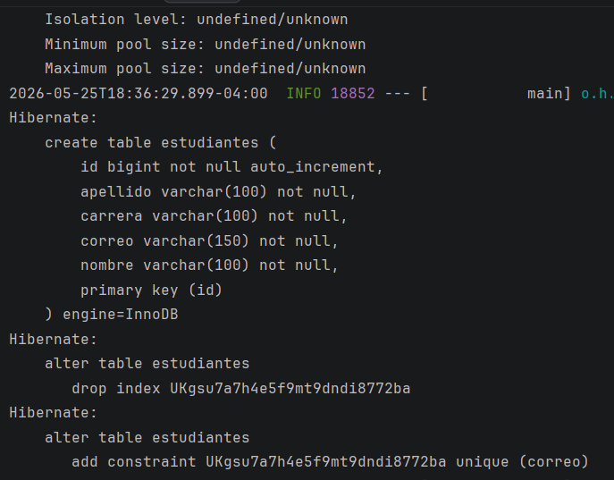
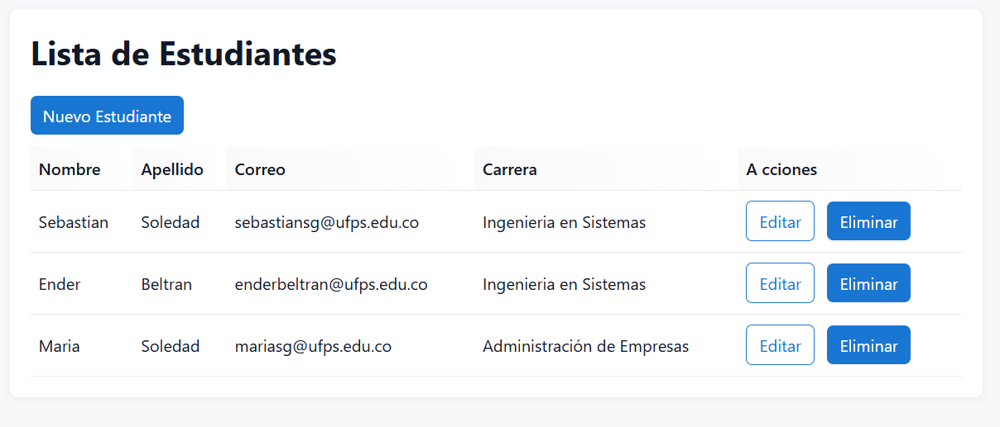
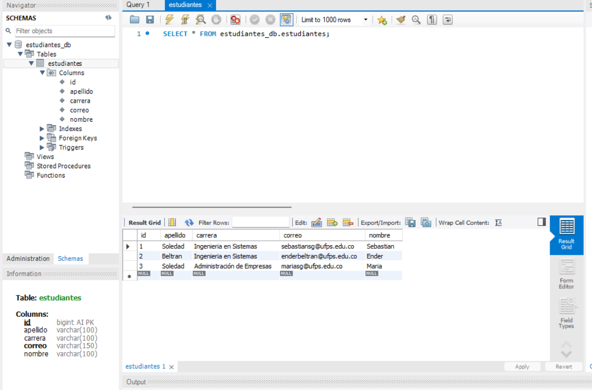
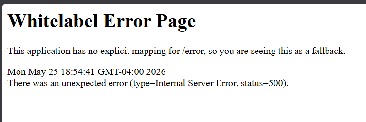
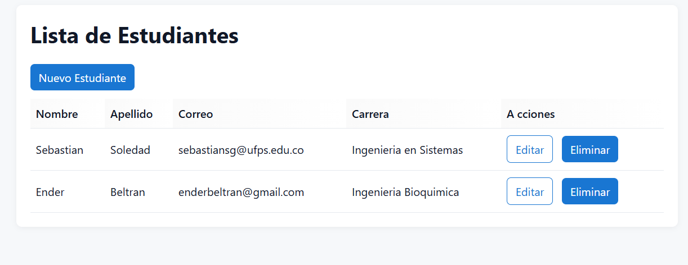
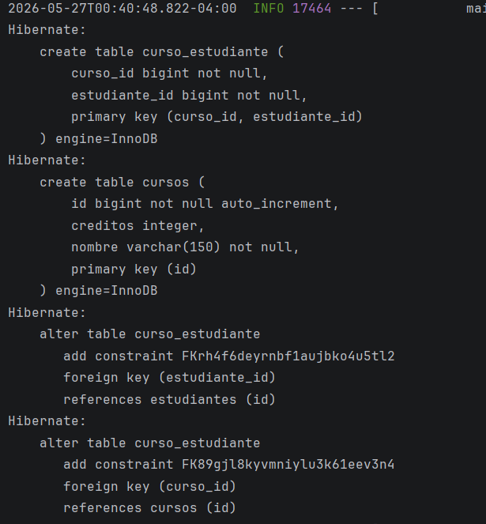
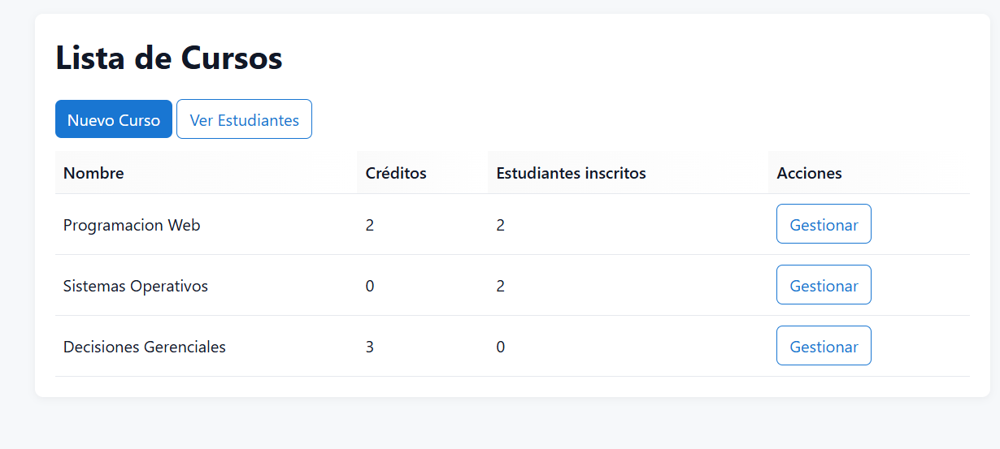

# Estudiantes — CRUD de Estudiantes y Cursos con Spring Boot

Aplicación web construida con Spring Boot, Spring Data JPA, Hibernate, Thymeleaf y MySQL.
Permite administrar dos entidades principales:

- `Estudiante`
- `Curso`

Además, implementa una relación `@ManyToMany` para inscribir estudiantes en cursos.

---

## 1. Estructura general del proyecto

- `src/main/java/com/universidad/estudiantes/controller` — controladores MVC.
- `src/main/java/com/universidad/estudiantes/service` — lógica de negocio.
- `src/main/java/com/universidad/estudiantes/repository` — acceso a datos con JPA.
- `src/main/java/com/universidad/estudiantes/model` — entidades JPA.
- `src/main/resources/templates/estudiantes` — vistas de estudiantes.
- `src/main/resources/templates/cursos` — vistas de cursos.
- `src/main/resources/static/css/styles.css` — estilos globales.
- `docs/screenshots` — evidencias visuales del funcionamiento.

---

## 2. Entidad `Estudiante`

Archivo: `src/main/java/com/universidad/estudiantes/model/Estudiante.java`

### Atributos principales

- `Long id`
- `String nombre`
- `String apellido`
- `String correo`
- `String carrera`

### Anotaciones importantes

- `@Entity`
- `@Table(name = "estudiantes")`
- `@Id`
- `@GeneratedValue(strategy = GenerationType.IDENTITY)`
- validaciones con Bean Validation:
  - `@NotBlank`
  - `@Size`
  - `@Email`

### Relación con cursos

La entidad también tiene una colección de cursos:

- `Set<Curso> cursos`
- lado inverso de la relación `@ManyToMany`

---

## 3. Entidad `Curso`

Archivo: `src/main/java/com/universidad/estudiantes/model/Curso.java`

### Atributos principales

- `Long id`
- `String nombre`
- `int creditos`
- `Set<Estudiante> estudiantes`

### Anotaciones importantes

- `@Entity`
- `@Table(name = "cursos")`
- `@Id`
- `@GeneratedValue(strategy = GenerationType.IDENTITY)`
- validación en el nombre con `@NotBlank`

### Relación con estudiantes

`Curso` es el lado propietario de la relación:

- define la tabla intermedia `curso_estudiante`
- controla las columnas `curso_id` y `estudiante_id`
- usa métodos auxiliares:
  - `agregarEstudiante(Estudiante e)`
  - `quitarEstudiante(Estudiante e)`

---

## 4. Diagrama ER de la relación `@ManyToMany`

La relación entre estudiantes y cursos es de **muchos a muchos**:

```text
ESTUDIANTES                      CURSOS
--------------                   --------------
id (PK)                          id (PK)
nombre                           nombre
apellido                         creditos
correo
carrera
     \                             /
      \                           /
       \                         /
        \                       /
         \                     /
          \                   /
           \                 /
            \               /
             \             /
              \           /
               \         /
                \       /
                 \     /
                  \   /
             CURSO_ESTUDIANTE
             -----------------
             curso_id (FK)
             estudiante_id (FK)
```

### Interpretación

- Un estudiante puede inscribirse en varios cursos.
- Un curso puede tener varios estudiantes.
- La tabla intermedia `curso_estudiante` guarda la relación.

---

## 5. Configuración de la base de datos MySQL

### Requisitos

- Java 17
- Maven
- MySQL 8

### Crear base de datos y usuario

Conéctate con MySQL Workbench o con el cliente `mysql` y ejecuta:

```sql
CREATE DATABASE IF NOT EXISTS estudiantes_db
  CHARACTER SET utf8mb4
  COLLATE utf8mb4_unicode_ci;

CREATE USER IF NOT EXISTS 'appuser'@'localhost'
  IDENTIFIED WITH mysql_native_password BY 'apppass';

GRANT ALL PRIVILEGES ON estudiantes_db.* TO 'appuser'@'localhost';
FLUSH PRIVILEGES;
```

Si quieres verificar el plugin del usuario:

```sql
SELECT user, host, plugin
FROM mysql.user
WHERE user = 'appuser';
```

---

## 6. Configuración de `application.properties`

Archivo: `src/main/resources/application.properties`

Ejemplo recomendado:

```properties
server.port=8080

spring.datasource.url=jdbc:mysql://localhost:3306/estudiantes_db?useSSL=false&serverTimezone=UTC
spring.datasource.username=appuser
spring.datasource.password=apppass
spring.datasource.driver-class-name=com.mysql.cj.jdbc.Driver

spring.jpa.hibernate.ddl-auto=update
spring.jpa.show-sql=true
spring.jpa.properties.hibernate.format_sql=true
```

### Si aparece el error `Public Key Retrieval is not allowed`

Puedes resolverlo de dos maneras:

1. **Rápida para desarrollo**: agregar `allowPublicKeyRetrieval=true` a la URL JDBC.

```properties
spring.datasource.url=jdbc:mysql://localhost:3306/estudiantes_db?useSSL=false&serverTimezone=UTC&allowPublicKeyRetrieval=true
```

2. **Recomendada**: mantener el usuario con `mysql_native_password`, como en el SQL anterior.

---

## 7. Cómo ejecutar el proyecto

### Con Maven Wrapper

```powershell
.\mvnw.cmd -DskipTests package
.\mvnw.cmd spring-boot:run
```

### Ejecutando el JAR

```powershell
java -jar target\estudiantes-0.0.1-SNAPSHOT.jar
```

> Nota: para ejecutar el JAR necesitas Java 17 en tu `PATH` o `JAVA_HOME`.

---

## 8. Rutas principales de la aplicación

### Estudiantes

- `http://localhost:8080/estudiantes`
- `http://localhost:8080/estudiantes/nuevo`

### Cursos

- `http://localhost:8080/cursos`
- `http://localhost:8080/cursos/nuevo`
- `http://localhost:8080/cursos/{id}/inscribir`

---

## 9. Vistas Thymeleaf

### Estudiantes

- `src/main/resources/templates/estudiantes/lista.html`
- `src/main/resources/templates/estudiantes/formulario.html`
- `src/main/resources/templates/estudiantes/confirmar-eliminar.html`

### Cursos

- `src/main/resources/templates/cursos/lista.html`
- `src/main/resources/templates/cursos/formulario.html`
- `src/main/resources/templates/cursos/inscribir.html`

### Estilos

- `src/main/resources/static/css/styles.css`

---

## 10. Capturas de pantalla

Las capturas están en `docs/screenshots`.

### Unidad 1 — Estudiantes

- `docs/screenshots/u1/tablas-consola.png`
- `docs/screenshots/u1/estudiantes-creados.png`
- `docs/screenshots/u1/estudiantes-creados-db.png`
- `docs/screenshots/u1/error-correo-duplicado.png`
- `docs/screenshots/u1/cambios-hechos.png`

### Unidad 2 — Tablas y relación de cursos

- `docs/screenshots/u2/creacion-tablas.png`
- `docs/screenshots/u2/estudiantes-inscritos.png`

### Evidencia de inscripción funcionando

La captura `docs/screenshots/u2/estudiantes-inscritos.png` muestra el flujo de inscripción funcionando correctamente.
La captura `docs/screenshots/u2/creacion-tablas.png` muestra la creación de las tablas necesarias para la relación.

### Vista previa en el README









---

## 11. Errores comunes y solución rápida

- **`useSSL` con valor vacío**: revisa que la URL JDBC esté en una sola línea.
- **`Communications link failure`**: MySQL no está corriendo o el puerto 3306 no responde.
- **`Public Key Retrieval is not allowed`**: agrega `allowPublicKeyRetrieval=true` o usa `mysql_native_password`.
- **`UnsupportedClassVersionError`**: necesitas Java 17.

---

## 12. Buenas prácticas aplicadas

- Separación por capas: controller / service / repository / model.
- Inyección por constructor.
- Uso de `@Transactional` en servicios.
- Uso de Bean Validation en formularios.
- Estilos centralizados en una sola hoja CSS.

---

## 13. Resumen funcional

La aplicación permite:

- crear, editar y eliminar estudiantes,
- crear y listar cursos,
- inscribir y desinscribir estudiantes en cursos,
- visualizar la relación en la tabla intermedia `curso_estudiante`,
- y documentar el proceso con capturas en `docs/screenshots`.
